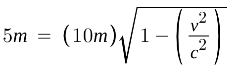
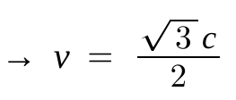

**민코프스키 세계선으로 이해하는 헛간의 역설**

# 헛간의 역설

>
>2024학년도 수능특강 헛간의 역설 문제

**헛간의 역설**은 우리가 생각하는 동시성의 개념을 재고하게 만들어주는 특수상대성 이론의 매우 유명한 역설이다.

쌍둥이 역설과 더불어 상대성 이론에 대한 지식을 늘리기에 좋은 역설 중 하나다. 그 내용을 알아보자.


위와 같은 상황에서 헛간이 정지해 있다고 보는 현빈이는 막대를 길이 수축을 이용해 헛간에 넣고 싶어 한다.

{: width="200" height="60"}    {: width="120" height="60"}

따라서 대략 0.86602540378*c의 속도로 운동하면 현빈이의 관성계에선 길이수축이 충분히 일어나 헛간 안에 막대를 잠깐 넣을 수 있다.

하지만 막대를 옮기는 성민이의 관성계에선 오히려 헛간에 길이수축이 일어나 헛간의 폭이 2.5m가 된다.

이 역설을 어떻게 풀 수 있을까?

# 민코프스키 세계선

민코프스키 세계선을 이해하면 쉽게 특수상대성 이론을 이해하고, 역설을 해결할 수 있다.

로렌츠 인자에 대한 설명은 고교 물리1을 심화 학습 한다면 충분히 이해할 수 있으므로 생략한다. 

아무튼, 상대성 이론에선 **빛의 속력보다 더 큰 속력을 가질 수 없다.** 라는 명제로 두 좌표 S(x, y, z, ct), S1(x1, y1, z1, ct1)에 다음과 같은 관계가 있음을 밝힌다.

```python
x1 = 𝛾(x−vt)
ct1 = 𝛾(ct−𝛽x)
```

